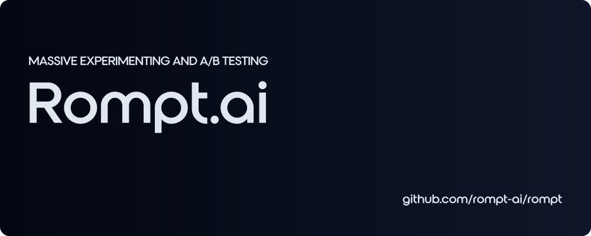

<p align="center">
Uncover the best prompts for your GPT-Powered applications with Rompt's system to <b>Generate</b>, <b>Test</b>, and <b>Evaluate</b> Prompt Combinations.
</p>

## Get started

### Requirements

- Node.js >18
- Postgres database

### Installation

First, clone the repository and install the dependencies:

```sh
git clone https://github.com/rompt-ai/rompt.git
cd rompt
npm i
```

Then, create a `.env` file in the root directory following using the schema of the `.env.example` file.

| Key | Description |
|-|-|
| `DATABASE_URL` | Postgres connection string used by prisma. See [the Prisma docs](https://www.prisma.io/docs/concepts/database-connectors/postgresql) for more information. |
| `OPENAI_API_KEY` | An API key for the OpenAI API. Create an API key [here](https://platform.openai.com/account/api-keys). |
| `NEXT_PUBLIC_STREAM_PORT` | The port that the stream server will run on. `3216` is a sensible default. |
| `HMAC_SECRET` | A secret string used in requests to the stream server. |


Next, configure your database with Prisma with the following command. _Note that this will drop any existing tables in your database._

```sh
npm run reset:db
```

Then, install the dependencies for the stream server:

```sh
cd stream
npm i
cd ..
```

Finally, build and start the server:

```
npm run build
npm run start
```

Navigate to [http://localhost:3000](http://localhost:3000) to access the web app.
